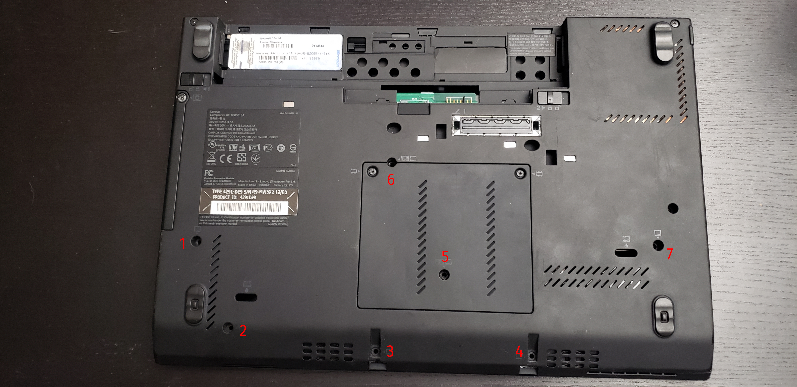
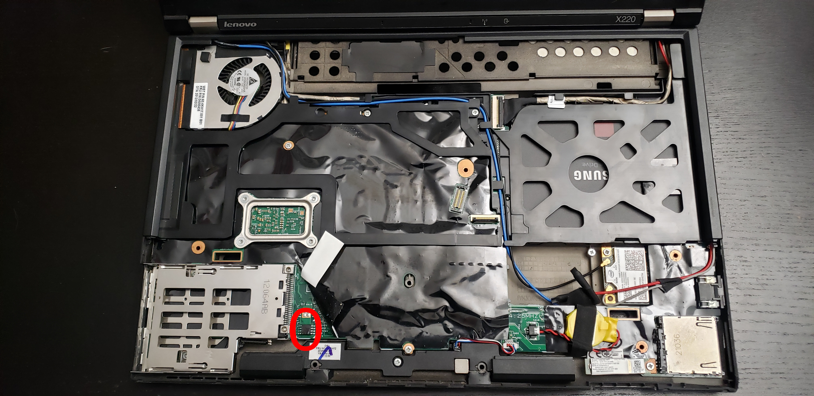
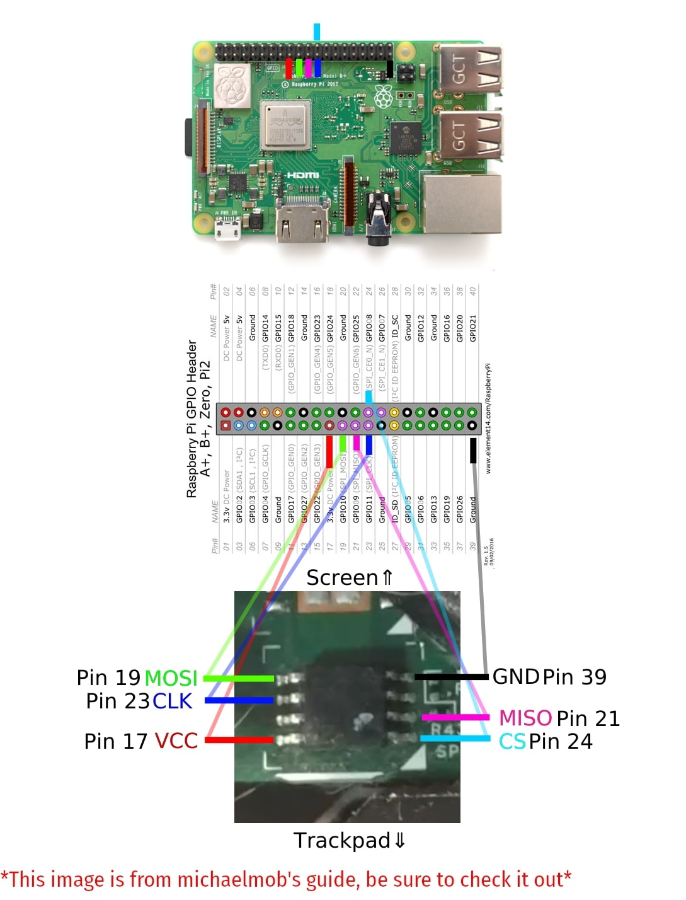
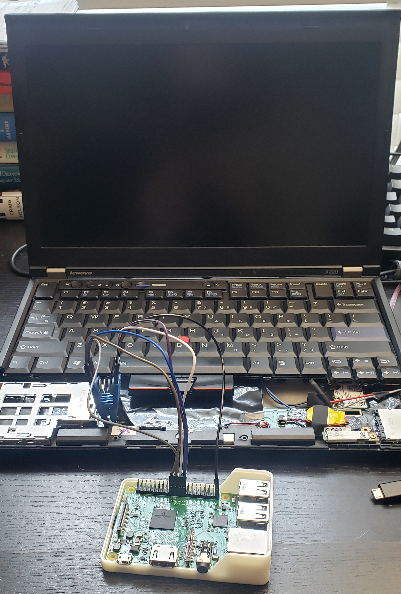

# x220-coreboot-image-and-guide
My personal ThinkPad X220 coreboot image and installation guide. 
This repository is mainly intended as a way for me to document my coreboot efforts for later reference. With that, it may be helpful to other people looking to coreboot their ThinkPad X220.

### References and Resources
This guide is heavily based on [michaelmob's guide](https://github.com/michaelmob/x220-coreboot-guide) and [Tyler Cipriani's guide](https://tylercipriani.com/blog/2016/11/13/coreboot-on-the-thinkpad-x220-with-a-raspberry-pi/). These guides may have more details concerning any issues you encounter.

### Other Helpful Resources
- [coreboot documentation](https://doc.coreboot.org/)
- [Tripcode7's X220 coreboot video](https://www.youtube.com/watch?v=ExQKOtZhLBM)
- [coreboot subreddit](https://www.reddit.com/r/coreboot/)

### Items Needed
- Thinkpad X220
- Raspberry Pi (Any model works fine, I used a Model 3 B V 1.2)
- A separate computer running Linux (Used for compiling)
- Internet connection
- [8 pin soic clip](https://www.pomonaelectronics.com/products/test-clips/soic-clip-8-pin)
- [6 Female to Female jumper cables](https://www.amazon.com/GenBasic-Piece-Female-Jumper-Wires/dp/B01L5ULRUA)
- Philips head screwdriver

### Understanding What Coreboot is
In short, coreboot is free and open-source software that allows for the compilation of a custom image computer's proprietary BIOS. For laptops with older model Intel processors this software also allows for the Intel Management Engine to be stripped from your system. For someone interested in technology and privacy this is a relatively small step you can take to securing your technology while learning more about your computer. To learn more about coreboot, the systems it supports, and personal computing privacy check out the [coreboot webpage](https://www.coreboot.org/).

## Pre-compilation Preparation
The big difference between my guide and the ones I referenced is where I compiled my coreboot image. Those guides have you set up all of the software to compile a coreboot image on the Raspberry Pi itself. This is extremely time-consuming given the strength of Raspberry Pi's. Compilation on the Pi itself takes hours. In my process. I will be compiling the image on a separate computer, using the pi as a tool for flashing and extracting binaries.

### Laptop Disassembly: Accessing the BIOS chip 
1. Before disassembly of any system make sure it is unplugged and that the battery is removed. 
2. Unscrew the seven screws on the bottom of your X220 used to hold down the keyboard and palm rest.
   
3. After unscrewing, flip your X220 over and remove the keyboard and palm rest. 
4. After removing the keyboard and palm rest peel back the corner of the black protective plastic to find the BIOS chip we will be flashing.
   

A helpful video highlighting the specifics of disassembly: [X220 Teardown](https://www.youtube.com/watch?v=iJs01Q8EuDw) 

### Raspberry Pi Setup: Internet Connection, SPI, SSH, and Binary Extraction
1. Install the corresponding Raspbian (Raspberry Pi OS) image onto your Pi. Graphical interface only really matters if you are planning on using your Pi for more. For this project you will need just the terminal and an internet connection. See the Raspberry Pi website for an [imaging guide](https://www.raspberrypi.org/documentation/installation/installing-images/).
2. If you haven't already during your installation and setup process make sure your Pi is connected to the internet, the proceeding steps will depend on an internet connection.
3. Enabling SPI is a crucial step, this will allow for use of the [GPIO](https://www.raspberrypi.org/documentation/usage/gpio/) pins on the top of your Pi.
    ```
    sudo raspi-config

    // Go to the "Interfacing Options Menu"
    // Enable "SPI"

    // Optional: Enable SSH
    // I was able to SSH without enabling SSH, but if you have issues enable SSH in the same menu

    reboot
    ```
4. Update General Dependencies
    ```
    sudo apt update && sudo apt upgrade
    ```
5. Install Flashrom
    ```
    sudo apt install flashrom
    ```
6. SOIC Clip and SPI Interface
    
    Connect the SOIC clip pins to the Raspberry Pi pins following the layout in the diagram below:
    

    Afterward, connect the SOIC clip to the BIOS chip without power to the Raspberry Pi: 
    
    
7. Reading the BIOS chip
    Power on the Pi and ssh in from another computer with the following command
    ```
    ssh pi@10.0.0.91
   
    // 10.0.0.91 is the IP of my Pi, make sure to check yours first  
    ```
   
    Create an alias for the flashrom command, you will be using it a lot 
    ```
      alias fr='sudo flashrom -p linux_spi:dev=/dev/spidev0.0,spispeed=512'
    ```
    Read the contents of the BIOS chip by running the alias we just made. If no chip is found power off your Pi, check the connections, and then repeat the process     until you get proper readings.
    Using the chip name outputted in the terminal, rerun the alias in the following format to extract the binary. This binary is extremely important and is your
    backup. Be sure to save it in multiple safe locations.
    ```
    fr -c "$CHIP_NAME" -r flash01.bin
    ```
8. Moving the Binary to a Separate Computer
   Now that you have the binary, you can begin making the modifications needed for corebooting. I prefer to do this on my separate stronger computer, so
   transferring the file can be done through the scp command. 
   You can exit the ssh terminal and return to the normal terminal on your main computer then run:
   ```
   scp pi@10.0.0.91:flash01.bin ~/

   // Remember to use your Pi's IP
   // I copied the file into my home directory, you can change the destination if needed 
   ```
   Now that the binary is on your separate computer we can install the necessary coreboot dependences for a proper build!
   
## Compilation Preparation
### Installing Dependencies and Tools: Coreboot, ifdtool, and me_cleaner
I am doing all of this on a separate computer as noted before, not a Pi.
1. Install needed dependencies
    ```
    sudo apt-get install -y bison build-essential curl flex git gnat libncurses5-dev m4 zlib1g-dev

    // This dependency list was taken from the coreboot documentation 
    // If you run into issues check for an updated list at https://doc.coreboot.org/
    ```
2. Clone and Compile Coreboot
   ```
   git clone --recurse-submodules https://review.coreboot.org/coreboot.git ~/coreboot
   ```
3. Compile ifdtool 
   ```
   cd ~/coreboot/util/ifdtool
   make && sudo make install
4. Clone me_cleaner
   ```
   git clone https://github.com/corna/me_cleaner ~/me_cleaner
   ``` 
### Binary Modification: Neutering the IME and Extracting Binary Blobs
  1. Run me_cleaner on flash01.bin
     ```
     ~/me_cleaner/me_cleaner.py -S flash01.bin
     ```
  2. Extract Binary Blobs With ifdtool 
     ```
     ifdtool -x flash01.bin
     ```
  3. Move Blobs to Correct Locations in The Coreboot directory
     ```
     mkdir -p ~/coreboot/3rdparty/blobs/mainboard/lenovo/x220
     cd ~/coreboot/3rdparty/blobs/mainboard/lenovo/x220
     mv ~/flashregion_0_flashdescriptor.bin descriptor.bin
     mv ~/flashregion_2_intel_me.bin me.bin
     mv ~/flashregion_3_gbe.bin gbe.bin
     ```
 
## Coreboot Compilation and Flashing
  1. Configure Coreboot
     Notes about my build:
      - My coreboot image uses SeaBIOS. I added pre-extracted VGABIOS firmware just in case I ever need to run windows on
        this machine. Ultimately I will not need windows, but if I ever sell this laptop someone else might want
        windows. If you plan on using SeaBIOS you can use the same VGABIOS firmware in this repository. 
      - I elected for a bootsplash image. If you don't upload your own bootsplash image, none will show up at all.
        What's the fun in no bootsplash? I got my bootsplash off of reddit, and you can find more bootsplashes [here](https://github.com/ifrit05/coreboot-bootsplashes). 
        Bootsplashes have to be 1024x768, so making a custom one isn't too difficult.
      ```
      cd ~/coreboot
      make nconfig 
      
      // These are the parameters I chose for my coreboot build, they are pretty standard
      // For more information on a specific parameter press Shift+? 

      General setup
      [*] Compress ramstage with LZMA
      [*] Include the coreboot .config file into the ROM image
      [*] Allow use of binary-only repository
      [*] Add a bootsplash image
          (/home/matlac/coreboot/bootsplash.jpg) Bootsplash path and filename
          
      Mainboard
      Mainboard vendor (Lenovo)
      Mainboard model (ThinkPad X220)
      (LENOVO) Mainboard vendor name
      ROM chip size (8192 KB (8 MB))
      System Power State after Failure (S5 Soft Off)
      ()  fmap description file in fmd format
      (0x100000) Size of CBFS filesystem in ROM
      
      Chipset
      [*] Enable VMX for virtualization
      [*] Add Intel descriptor.bin file
          (3rdparty/blobs/mainboard/$(MAINBOARDDIR)/descriptor.bin) Path and filename
      [*] Add Intel ME/TXE firmware
          (3rdparty/blobs/mainboard/$(MAINBOARDDIR)/me.bin) Path to management engine firmware
      [*] Add gigabit ethernet firmware
          (3rdparty/blobs/mainboard/$(MAINBOARDDIR)/gbe.bin) Path to gigabit ethernet
      
      Devices
      Graphics initialization (Run VGA Option ROMs)
      (0) Graphics initialization delay in ms
      [*] Add a VGA BIOS image
          (/home/matlac/coreboot/vga-8086-0126.bin) VGA BIOS path and filename
          (8086,0126) VGA device PCI IDs
      [*] Add a Video Bios Table (VBT) binary to CBFS
          (src/mainboard/$(MAINBOARDDIR)/variants/$(VARIANT_DIR)/data.vbt) VBT binary
      
      Generic Drivers
      [*] PS/2 keyboard init
      [*] Support Intel PCI-e WiFi adapters
      
      Console
      [*] Squelch AP CPUs from early console.
      [*] Show POST codes on the debug console
      
      System tables
      [*] Generate SMBIOS tables
        
      Payload
      Add a payload (SeaBIOS)
      SeaBIOS version (master)
      [*] Hardware init during option ROM execution   
      [*] Use LZMA compression for secondary payloads
      ```
  2. Build Coreboot
     ```
     make coreboot
     
     // Creates coreboot.rom in ~/coreboot/build
      
  3. Transfer coreboot.rom back to the Pi
     ```
     scp ~/coreboot/build/coreboot.rom pi@10.0.0.91:~/

     // Remember to use your Pi's IP
     // I copied the file into my home directory, you can change the destination if needed 
     ```

  4. Flash BIOS Chip
     ```
     fr -c "$CHIP_NAME" -w coreboot.rom
     ``` 
Flashing should take a few minutes, but once you are done that's it! You can power down your Pi and reassemble your ThinkPad. Enjoy your corebooted laptop!
